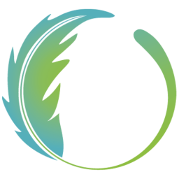

<h1 align="center">Orezia</h1>

    
    
    

---
### **<ins>
Liens Utiles :
**

• 🪶 Site internet : <a href="https://oreziamc.fr">https://oreziamc.fr</a> 
• ⚙️ Support (Discord) : <a href="https://discord.oreziamc.fr">https://discord.oreziamc.fr</a> 
• 📖 WikOrezia (Wiki) : <a href="https://wiki.oreziamc.fr">https://wiki.oreziamc.fr</a> 
• 💎 Boutique : <a href="https://boutique.oreziamc.fr">https://boutique.oreziamc.fr</a> 

---
### **<ins>
Fonctionnalitées du launcher :
**

- ✅ Mise à jour automatiques
- 🔒 Authentification Microsoft.
- ⚙️ Gestion intuitive des paramètres, y compris un panneau de configuration Java.

---
### **<ins>
Téléchargement :
**

Vous pouvez télécharger le launcher à partir des [Releases GitHub](../../../releases).

Plateformes supportées :

- Windows 
- Linux
- MacOS

Si vous téléchargez à partir des Releases, sélectionnez le programme d'installation de votre système.

 Plateforme | Fichier |
| -------- | ---- |
| Windows x64 | `Selvania-Launcher-win-x64.exe ` |
| macOS x64 | `Selvania-Launcher-mac-x64.dmg` |
| macOS arm64 | `Selvania-Launcher-mac-arm64.dmg` |
| Linux x64 | `Selvania-Launcher-linux-x86_64.AppImage` |

---